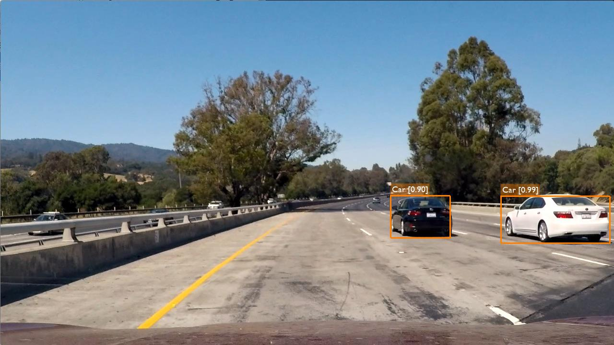
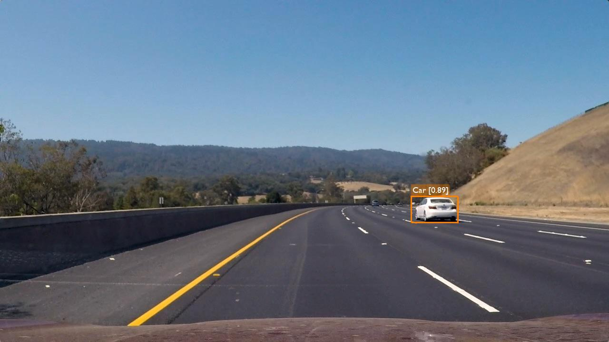
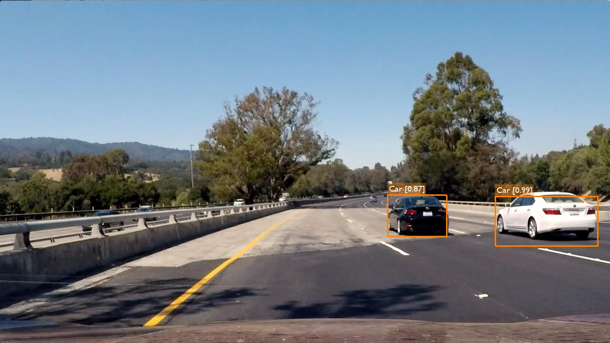
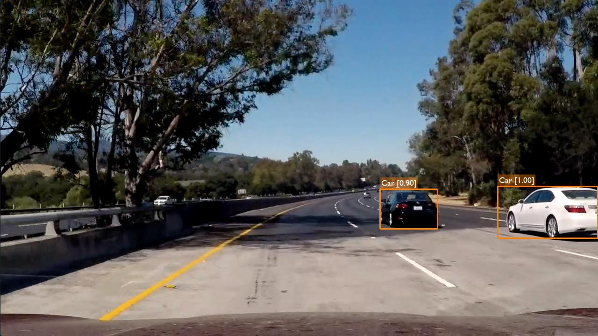
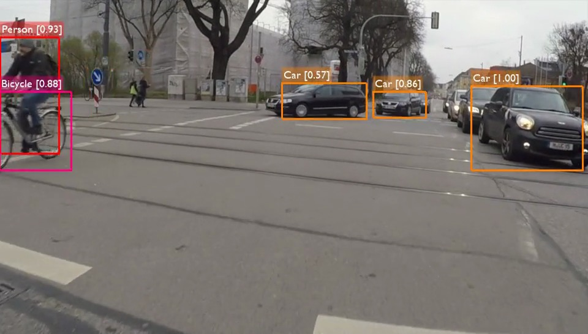
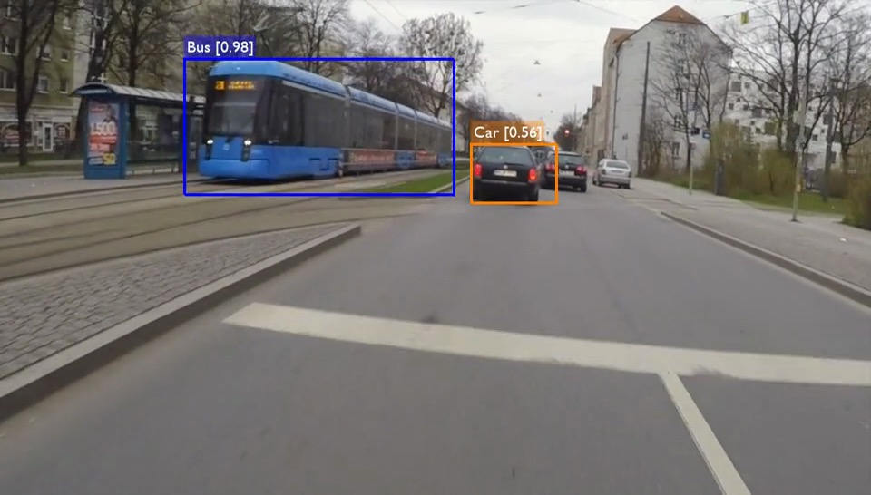
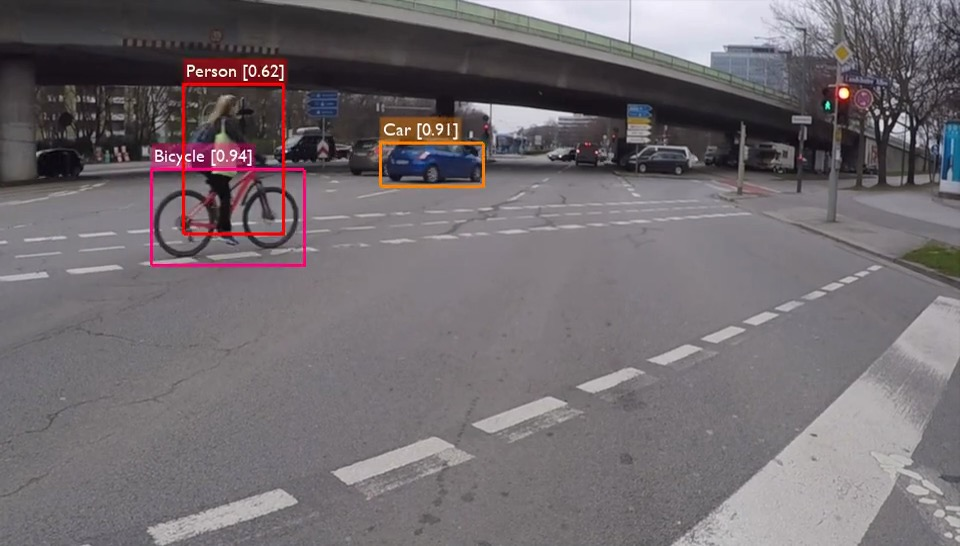

# CarND Project 5: Vehicle Detection
[](http://www.udacity.com/drive)

In this project, your goal is to write a software pipeline to detect vehicles in a video (start with the test_video.mp4 and later implement on full project_video.mp4), but the main output or product we want you to create is a detailed writeup of the project.  Check out the [writeup template](https://github.com/udacity/CarND-Vehicle-Detection/blob/master/writeup_template.md) for this project and use it as a starting point for creating your own writeup.


## Note

I checked with Udacity staff (Ryan Keenan) that it is possible to use a deep learning approach _instead_ of HOG/SVM to solve this project. I therefore describe my approach in solving this project using deep learning (SSD) instead of using HOG/SVM.

# General Approach

For this project I decided to use a deep learning based approach as opposed to the classic computer vision approach using HOG (Histogram of Oriented Gradients) in combination with a Linear SVM classifier. I chose to try a DL based solution out of personal interest as well as out of performance reasons. Using a classifier on HOG features is faster than passing an image through a deep CNN, but the need for a sliding window heavily slows down the whole process as each image then requires up to a hundred patches to be cropped and classified. The CNN approach requires the image to be only processed once.

## Choice of Neural Network

There are several neural network architectures, which have been developed to solve the task of detecting object boundaries in an image. Most prominently, R-CNN, Fast-R-CNN, Faster-R-CNN, YOLO and SSD are known to yield good results. Comparing the speed and accuracy of these networks quickly reveals that YOLO and SSD are the fastest options, with SSD taking the lead. Accuracy-wise SSD has high scores. SSD exists in two variants: SSD300 and SSD512. The numbers denote the pixel dimensions of the input images. While SSD512 has a slightly higher accuracy, SSD300 has shorter processing times per image and therefore results in a higher fps rate. Out of these considerations I chose to apply SSD300 for this project.


# Single Shot Multibox Detector (SSD)

The [SSD network](https://arxiv.org/abs/1512.02325) is based on a convolutional network structure. Typically, VGG-16 is used as base network, on top of which, instead of fully connected layers, more convolutional layers are stacked. Objects are detected by relying on features detected in various layers from the network. As illustrated below, the features from six layers are used for object detection.


## Implementation

The original SSD network was implemented using Caffe. There are also a Keras ports existing [here](https://github.com/rykov8/ssd_keras) and [here](https://github.com/oarriaga/single_shot_multibox_detector). I use the latter for this project as it supports Keras 2. The network implementation in this repository can be found [here](helpers/ssd.py).

## Training

Training the SSD300 network takes a considerable amount of time. As pre-trained weights for this network exist, I chose to use the weights available [here](https://github.com/oarriaga/single_shot_multibox_detector/blob/master/trained_models/weights_SSD300.hdf5). The weights were trained using the Pascal VOC dataset. They are included in this repository [here](weights_SSD300.hdf5) and loaded in [`main.py`](main.py#L32).

## Output

The SSD network outputs predictions in the form `[label, confidence, x_min, y_min, x_max, y_max]`. In order to only display relevant predictions, a [threshold is applied](helpers/utils.py#L62). A lower threshold will enable us to detect more objects, but also increase the potential for false positives. A higher threshold reduces the false positives, but increases the odds of not detecting a few objects.

I picked a threshold of [0.5](helpers/utils.py#L40). Furthermore, as we're only interested in detecting vehicles, I only draw objects belonging to the classes `'Car', 'Bus', 'Motorbike', 'Bicycle', 'Person'` (see [`helpers/utils.py`, line 88](helpers/utils.py#L88)).

## Non-Maximum Suppression

Naturally, the network returns multiple hits per actual object in the image. The next stept is to take all predictions and to try to unify those, that match the same object. This is done by using the technique of non-maximum suppresion. Instead of simply drawing the largest bounding box around all predictions for one object, the bounding box groups the most confident predictions. The non-maximum suppression is applied in [`detection_out(...)` in `helpers/ssd_utils.py`](helpers/ssd_utils.py#L187).

## Usage

The file [`main.py`](main.py) demonstrates how the process works. First, we need to create the SSD300 model and load the weights as follows:

```python
input_shape=(300, 300, 3)
model = SSD300(input_shape, num_classes=VehicleDetector.NUM_CLASSES)
model.load_weights('./weights_SSD300.hdf5', by_name=True)
```

Then, an instance of `VehicleDetector` uses the model to detect and annotate objects in a given image:

```python
from PIL import Image

detector = VehicleDetector(model)

image = np.asarray(Image.open('test_images/test1.jpg'))
result = detector.detect(image)
```

## Result

With the method and settings described above, the following objects are detected in the provided [test images](test_images).


| Original Image | Annotated Image |
|----------------|-----------------|
|  |  |
|  |  |
|  |  |
|  |  |
|  |  |
|  |  |


The annotated project video can be viewed on Youtube as linked below or directly downloaded from this repository [here](output_videos/project_video.mp4)

[](http://www.youtube.com/watch?v=88UvIBJ19gU)


## Own Video

I was also curious to see how my solution performs on videos I recorded myself (on a motorbike).

Here are a few annotated sample images:






I additionally uploaded two more videos into this repository:

1. [my_video_1.mp4](output_videos/my_video_1.mp4)
1. [my_video_2.mp4](output_videos/my_video_2.mp4)


# Analysis

In general the deep learning approach to solving the vehicle detection problem seems very elegant compared to the manual crafting of features using OpenCV in combination with an SVM classifier. The latter not only requires a lot of parameter tuning but also is much slower and cannot be considered a "real time" solution. Although this comparison is not entirely fair, because the SSD is accelerated by using a GPU. Speeding up the HOG / SVM solution requires more thought and manual splitting of the algorithm into parallelizable parts.

Using an NVIDIA GeForce GTX 1080 with 8GB I achieved a speed of ~31fps.

All in all, the results above are very satisfying, but the SSD, too, has room for improvement. I used pre-trained weights, but I think this part could be improved as the network has difficulties detecting objects exceeding or not reaching certain dimensions. As can be seen in my own test videos, further away cars are mostly not detected because, after shrinking the frame to 300x300 pixels, they don't contain enough features anymore to be detected. The same happens when a car almost completely fills the frame. Therefore I suspect training with more various scales of objects would help mitigate this problem.

Another issue I observed was that object detection works less reliably when the recording angle is tilted. This is an issue with recording on a motorbike. In curves the bike and therefore the video recording is tilted. This is obviously not a problem for cars as the camera is fixed to the car and always recorded horizontally. But it was nevertheless interesting to observe. Training with augmented rotated images would likely solve this.

## Outlook

End of 2016 a revised version of YOLO ([YOLO 9000](https://arxiv.org/abs/1612.08242)) was published, which claims to have even higher accuracy and also higher fps-rates than SSD. This could be a nice improvement for this project, which I may investigate in the future.

# Acknowledgements

I would like to thank @rykov8 and @oarriaga for their Keras ports of SSD, which I used in this project.

# References

* [Towards a real-time vehicle detection: SSD multibox approach](https://chatbotslife.com/towards-a-real-time-vehicle-detection-ssd-multibox-approach-2519af2751c)
* [SSD: Single Shot MultiBox Detector](https://arxiv.org/abs/1512.02325)
* [SSD in Keras 2](https://github.com/oarriaga/single_shot_multibox_detector)
* [SSD in Keras 1](https://github.com/rykov8/ssd_keras)
* [YOLO](https://pjreddie.com/darknet/yolo/)
* [YOLO 9000](https://arxiv.org/abs/1612.08242)
* [YOLOv2 in Keras/TensorFlow](https://github.com/allanzelener/YAD2K)
---
* [Evolving Boxes for Fast Vehicle Detection](https://arxiv.org/abs/1702.00254)
